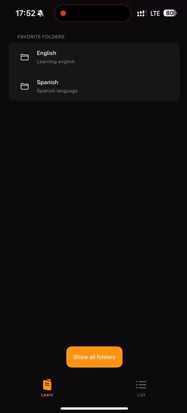

# Memory  

**Memory** is an iOS app designed to help users improve their memory through interactive flashcards.  

## Features  
- **Add Items:** Easily create and organize new flashcards with your own content.  
- **Train Your Memory:** Review and memorize your items using spaced repetition intervals.  
- **Effortless Learning:** Tailored for efficient and engaging practice to retain information long-term.  

Whether you're studying for exams, learning a new language, or just trying to remember important details, **Memory** is your go-to tool for effective learning.  

